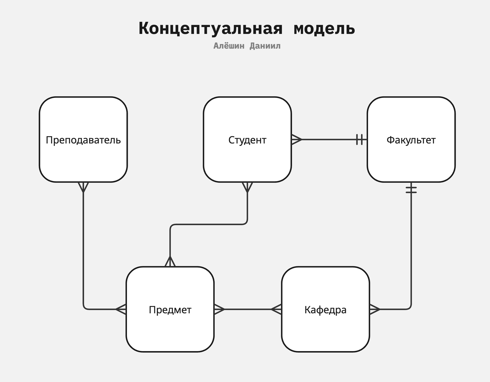
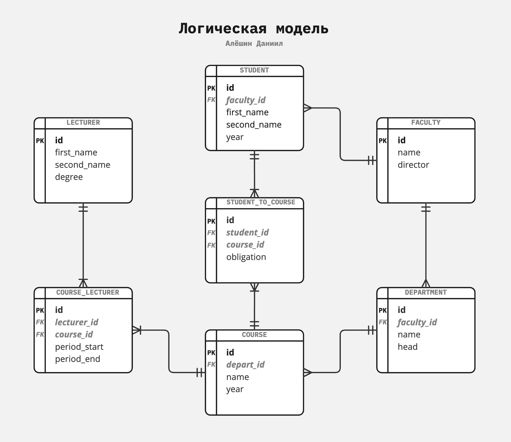

Проект по курсу "Базы Данных", весна 2025

Эта база данных предназначена для управления академической информацией в учебном заведении, таком как университет или институт.

База данных будет в 3НФ.

Таблица t_faculty, содержащая информацию о факультетах.

| Column    | Type   | Constraints |
|-----------|--------|-------------|
| id        | UUID   | PRIMARY KEY |
| name      | TEXT   | NOT NULL    |
| director  | TEXT   |             |

Таблица t_student, со списком студентов, связывающая их через faculty_id к соответствующему факультету.

| Column      | Type   | Constraints                         |
|-------------|--------|-------------------------------------|
| id          | UUID   | PRIMARY KEY                         |
| faculty_id  | UUID   | REFERENCES t_faculty(id)            |
| first_name  | TEXT   | NOT NULL                            |
| second_name | TEXT   | NOT NULL                            |
| year        | INTEGER|                                     |

Таблица t_department, отражающая департаменты, связанные с факультетом через faculty_id.

| Column      | Type   | Constraints                         |
|-------------|--------|-------------------------------------|
| id          | UUID   | PRIMARY KEY                         |
| faculty_id  | UUID   | REFERENCES t_faculty(id)            |
| name        | TEXT   | NOT NULL                            |
| head        | TEXT   |                                     |

Таблица t_course, с данными о курсах, связанных с департаментом через department_id.

| Column       | Type   | Constraints                         |
|--------------|--------|-------------------------------------|
| id           | UUID   | PRIMARY KEY                         |
| department_id| UUID   | REFERENCES t_department(id)         |
| name         | TEXT   | NOT NULL                            |
| year         | INTEGER| NOT NULL                            |

Связующая таблица t_student_to_course, между студентами и курсами, включает тип обязательности курса (obligation).

| Column      | Type           | Constraints                         |
|-------------|----------------|-------------------------------------|
| id          | UUID           | PRIMARY KEY                         |
| student_id  | UUID           | REFERENCES t_student(id)            |
| course_id   | UUID           | REFERENCES t_course(id)             |
| obligation  | obligation_type| NOT NULL                            |

Таблица t_lecturer, содержащая информацию о преподавателях и их степени.

| Column      | Type                | Constraints    |
|-------------|---------------------|----------------|
| id          | UUID                | PRIMARY KEY    |
| first_name  | TEXT                | NOT NULL       |
| second_name | TEXT                | NOT NULL       |
| degree      | lecturer_degree_type| NOT NULL       |

Связующая таблица t_course_lecturer, между курсами и преподавателями, с указанием периода преподавания.

| Column       | Type   | Constraints                          |
|--------------|--------|--------------------------------------|
| id           | UUID   | PRIMARY KEY                          |
| lecturer_id  | UUID   | REFERENCES t_lecturer(id)            |
| course_id    | UUID   | REFERENCES t_course(id)              |
| period_start | DATE   |                                      |
| period_end   | DATE   |                                      |
